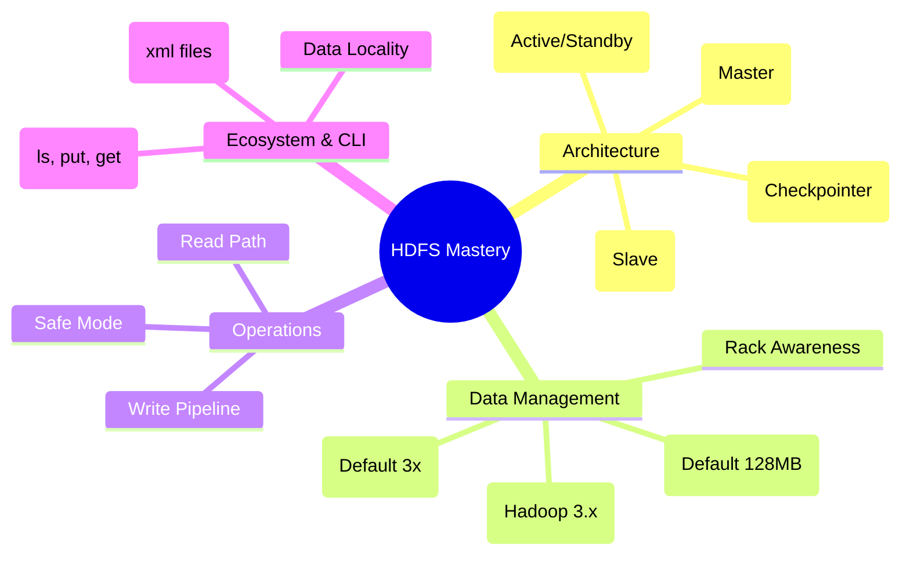

# HDFS Mind Map

---

#  Detailed Notes

## 1. Core Architecture Components

HDFS follows a **Master-Slave architecture** designed to store massive datasets across commodity hardware.

* **NameNode (The Librarian):**
* Acts as the master node and central repository for metadata.
* **Responsibilities:** Manages the filesystem namespace, keeps track of block locations, and handles client access requests (open, close, rename).
* **Storage:** Stores metadata in RAM for fast access; persists it on disk via `fsimage` and `edit logs`.

* **DataNode (The Worker):**
* Stores the actual data in the form of blocks.
* **Responsibilities:** Performs read/write operations as directed by the client/NameNode and sends periodic **Heartbeats** (status) and **Block Reports** (list of blocks) to the NameNode.

* **Secondary NameNode (The Helper):**
* **NOT a backup** for the NameNode.
* **Function:** Periodically merges `edit logs` with the `fsimage` to prevent the log file from growing too large, which reduces NameNode restart time.

---

## 2. High Availability (HA) & Fault Tolerance

In Hadoop 1.x, the NameNode was a **Single Point of Failure (SPOF)**. Hadoop 2.x+ introduced HA to ensure zero downtime.

* **Active/Standby NameNodes:** One node handles requests while the other stays synchronized using a **Shared Storage** (Quorum Journal Manager or NFS).
* **Zookeeper & ZKFC:** Zookeeper monitors the health of NameNodes. If the Active node fails, the **Zookeeper Failover Controller (ZKFC)** automatically promotes the Standby node to Active.
* **Heartbeats:** DataNodes send heartbeats every 3 seconds (default) to signal they are alive. If a node fails for 10 minutes, the NameNode marks it dead and re-replicates its blocks.

---

## 3. Data Strategy: Blocks & Replication

* **Block Size:** Files are split into blocks (Default: **128MB** in 2.x/3.x). Large blocks reduce NameNode metadata overhead and seek time.
* **Replication Policy:** The default factor is 3.
* **Rack Awareness:** To maximize reliability, NameNode places replicas across different racks:
1. **1st Replica:** On the local node.
2. **2nd Replica:** On a different node in a **remote rack**.
3. **3rd Replica:** On a different node in the **same remote rack**.

---

## 4. The Data Lifecycle (Write & Read)

### **The Write Pipeline**

1. **Client Request:** Client asks NameNode for permission to write.
2. **Metadata Check:** NameNode verifies permissions and provides addresses of 3 DataNodes.
3. **Pipeline Creation:** Data is split into packets. The client streams data to **DN1**, which forwards it to **DN2**, which forwards it to **DN3**.
4. **Acknowledgment:** Once the last node (DN3) receives the data, it sends an 'Ack' back up the pipeline to the client.

### **The Read Path**

1. **Block Discovery:** Client asks NameNode for the locations of a file's blocks.
2. **Closest Replica:** NameNode returns a list of DataNodes for each block, sorted by proximity to the client (**Data Locality**).
3. **Direct Stream:** Client connects directly to the nearest DataNode to read data parallelly.

---

## 5. Hadoop 2.x vs. 3.x (Expert Level Info)

| Feature | Hadoop 2.x | Hadoop 3.x |
| --- | --- | --- |
| **Fault Tolerance** | 3x Replication (200% overhead) | **Erasure Coding** (50% overhead) |
| **NameNodes** | Supports 2 NameNodes (1 Active, 1 Standby) | Supports **Multiple Standby** NameNodes |
| **Storage Efficiency** | High storage cost | Best for "Cold Data" using Erasure Coding |
| **Balancing** | HDFS Balancer (inter-node) | **Intra-node Disk Balancer** |

---

## 6. Essential HDFS CLI Commands

* **`hdfs dfs -ls /`**: List files in the root directory.
* **`hdfs dfs -mkdir /data`**: Create a new directory.
* **`hdfs dfs -put localfile /hdfs/path`**: Upload a file from local to HDFS.
* **`hdfs dfs -get /hdfs/path localpath`**: Download a file from HDFS.
* **`hdfs dfs -cat /path/to/file`**: View file content.
* **`hdfs dfsadmin -report`**: Check the overall health of the cluster.

---

##  Top 3 "Pro-Tips"

1. **The Small File Problem:** Storing millions of small files (e.g., 1KB) kills the NameNode because each file requires ~150 bytes of RAM for metadata. **Solution:** Use **HAR (Hadoop Archive)** or combine files using Spark/Hive before ingestion.
2. **Safe Mode:** This is a read-only state during NameNode startup where it doesn't allow any changes while it collects block reports from DataNodes.
3. **Data Locality:** Always emphasize that Hadoop brings "Computation to the Data," not "Data to the Computation," which saves massive network bandwidth.