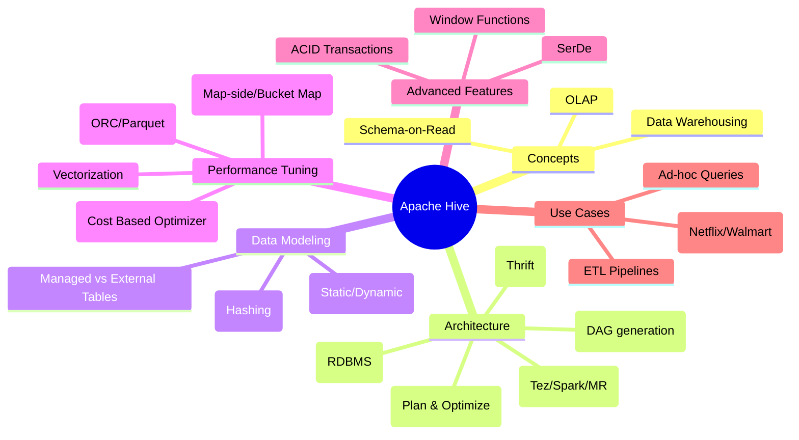
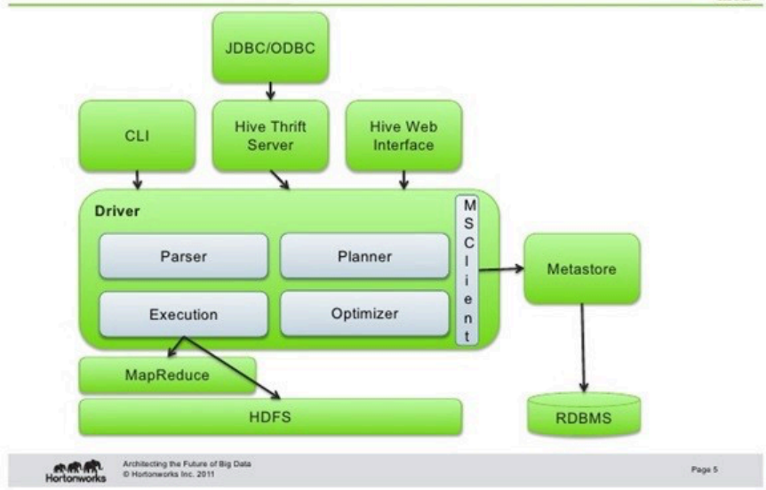

# Apache Hive 

As a Data Engineer, Hive is a cornerstone of your toolkit for handling **EB-scale data**. Below is a comprehensive markdown guide and a structured mind map design.

---

## Hive Mind Map (Overview)

---

##  1. Architecture: The "Engine Room"

* **Metastore:** The "Brain" that stores metadata (table definitions, partitions) in a separate RDBMS like **MySQL** or **Derby**.
* **Driver:** Manages the lifecycle of a query. It receives HQL, sends it to the **Compiler**, and manages the execution plan.
* **Compiler:** Converts HQL into a **DAG (Directed Acyclic Graph)** of MapReduce, Tez, or Spark jobs.
* **Execution Engines:** * **MapReduce:** Traditional, slow (disk-heavy).
* **Tez:** Optimized DAG execution; much faster as it reduces disk writes between stages.
* **LLAP (Live Long and Process):** Keeps data cached in memory for sub-second queries.

---

##  2. Data Modeling: Tables & Granularity

### Managed vs. External Tables 

| Feature | Managed (Internal) Table | External Table |
| --- | --- | --- |
| **Ownership** | Hive owns the data and schema. | Hive only owns the schema metadata. |
| **Drop Behavior** | Deletes **both** data and metadata. | Deletes **only** metadata; data stays in HDFS. |
| **Use Case** | Temporary/Work tables. | Shared data across tools (Spark, Pig). |
| **ACID** | Supports ACID transactions. | Does **not** support ACID. |

### Partitioning vs. Bucketing

* **Partitioning:** Creates a **subdirectory** for each distinct value (e.g., `date=2024-01-01`). Best for low-cardinality columns (Country, Year) to avoid the **Small Files Problem**.
* **Bucketing:** Splits data into a **fixed number of files** using a hash function on a column. Ideal for high-cardinality columns (User_ID) and optimizing **joins** and **sampling**.

---

##  3. Performance Optimization 

* **File Formats:** Use **ORC** or **Parquet**. ORC is highly optimized for Hive, supporting ACID and predicate pushdown (reading only required rows/columns).
* **Vectorization:** Processes a batch of **1024 rows** at once instead of one by one, reducing CPU overhead.
* **CBO (Cost-Based Optimizer):** Uses statistics (calculated via `ANALYZE TABLE`) to determine the most efficient execution path (e.g., join order).
* **Joins:**
* **Map-side Join:** Loads the small table into memory (Distributed Cache) to avoid the Shuffle phase.
* **Bucket Map Join:** If both tables are bucketed on the join key, only matching buckets are joined.

---

##  4. Advanced: ACID 

### ACID Transactions

To enable row-level **Update/Delete**, you must:

1. Enable `hive.support.concurrency`.
2. Use **ORC** format.
3. Set `transactional = true` in table properties.

* **How it works:** Hive uses **Delta files** to record changes and a **Compactor** (Minor/Major) to merge them with the base data.

---

##  5. Real-World Context (The Airbnb Example)

Refer to the **Airbnb Problem Statement**:

* **Challenge:** Using RDBMS for analytics caused slow reporting and impacted business-critical jobs as data grew.
* **Solution:** Moved to Hive to separate **OLTP** (transactional) from **OLAP** (analytical) workloads, enabling massive scale and fault tolerance.

---

**Expert Tip:** **Hive vs. Spark SQL**,  Hive is better for massive batch ETL and long-running queries due to its fault-tolerant nature, while Spark is superior for iterative machine learning and in-memory processing.

