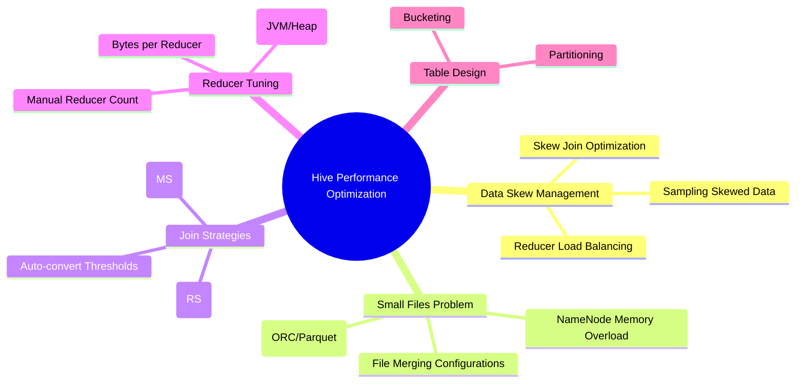

# Writing Effective & High-Performance Hive Queries


##  Mind Map Overview: Hive Optimization



---

## 1. Data Skew (The Performance Bottleneck)

Data skew occurs when data is imbalanced across partitions or nodes, causing specific reducers to handle significantly more data than others.

* 
**Impact**: It creates bottlenecks where a few reducers take much longer to finish, leading to long execution times and potential Out-of-Memory (OOM) errors.


* 
**Example**: If 90% of customer orders belong to a single `customer_id`, joining the `orders` and `customers` tables will overload one reducer while others remain idle.


### **Detection & Fixes**

* 
**Detection**: Use **Query Execution Plans** to inspect partitioning, monitor **YARN logs** for skewed reducer loads, and perform pre-join analysis on key frequencies.


* 
**Skew Join Optimization**: Enable this to detect skewed keys automatically and split them into smaller chunks.


* 
`SET hive.optimize.skewjoin=true;` 


* 
**Sampling Data**: Identify top frequent keys manually to adjust the execution strategy.


```sql
[cite_start]-- Identify frequent keys [cite: 1]
SELECT customer_id, COUNT(*) 
FROM orders 
GROUP BY customer_id 
ORDER BY COUNT(*) DESC 
LIMIT 10;

```


---

## 2. The Small Files Problem

This refers to having many files smaller than the HDFS block size (typically 128MB or 256MB).

* **NameNode Overload**: Each file occupies an entry in the NameNode's RAM. Millions of small files can lead to OOM errors on the master node.


* 
**I/O & Mapper Inefficiency**: Accessing many small files increases disk seek times and creates excessive MapReduce tasks with high startup overhead.


### **Solutions**

1. **File Merging**: Configure Hive to combine files at different stages.


* 
`SET hive.merge.mapfiles=true;` (Merge at map stage) 


* 
`SET hive.merge.mapredfiles=true;` (Merge at reduce stage) 


* 
`SET hive.merge.size.per.task=256000000;` (Merged file target size) 


2. **Efficient Formats**: Use **ORC** or **Parquet**. These columnar formats are compressed and optimized for batch processing, naturally reducing file counts.


```sql
[cite_start]-- Create an optimized ORC table [cite: 1]
CREATE TABLE my_table (id INT, name STRING) 
STORED AS ORC;

```


---

## 3. Join Optimizations: Shuffle vs. Broadcast

### **Shuffle Join (Standard)**

Both datasets are partitioned across nodes. Matching keys are "shuffled" across the network to the same reducer. This is resource-intensive due to network I/O.

### **Broadcast Join (Map-Side Join)**

A more efficient strategy used when one table is small enough to fit in memory. The small table is copied to all worker nodes, and the join happens locally on the mapper side, bypassing the reduce phase entirely.

* 
**When to use**: When one table is significantly smaller and fits in node memory.


* **How to enable**:
* 
`SET hive.auto.convert.join=true;` 


* 
`SET hive.auto.convert.join.noconditionaltask.size=10000000;` (e.g., 10MB threshold) 


---

## 4. Reducer & Memory Management

Overloaded reducers cause bottlenecks, OOM errors, and imbalanced resource usage.

* **Tuning Reducers**:
* 
**Balance Load**: `SET hive.exec.reducers.bytes.per.reducer=67108864;` (e.g., 64MB per reducer) ensures the system creates enough reducers for the data volume.


* 
**Manual Count**: `SET mapreduce.job.reduces=100;` (use with caution to avoid overhead).


* 
**Memory Allocation**: Increase memory for MapReduce or Tez tasks to prevent disk spilling.


* 
**MapReduce**: `SET mapreduce.reduce.memory.mb=8192;` 


* 
**Tez**: `SET tez.task.resource.memory.mb=8192;` 


---

## 5. Table Design for Performance

Proper architecture prevents performance issues before they start.

* **Partitioning**: Physically dividing data based on a column (e.g., date). It ensures only relevant folders are scanned.


```sql
CREATE TABLE partitioned_orders (...) 
PARTITIONED BY (order_date STRING) 
[cite_start]STORED AS PARQUET; [cite: 1]

```


* 
**Bucketing**: Distributes data into a fixed number of "buckets" based on a hash of a column (e.g., `customer_id`), ensuring reducers handle even amounts of data.


```sql
CREATE TABLE bucketed_orders (...) 
CLUSTERED BY (customer_id) INTO 32 BUCKETS 
[cite_start]STORED AS ORC; [cite: 1]

```


---

### **Expert Tip**

* **Vectorization**: Enable `hive.vectorized.execution.enabled=true`. This allows Hive to process a batch of 1024 rows at once instead of row-by-row, significantly reducing CPU usage for scanning, filtering, and joining.
* **Cost-Based Optimizer (CBO)**: Ensure `hive.cbo.enable=true` is set. CBO uses statistics (table size, number of rows) to generate the most efficient execution plan, such as choosing the best join order automatically.

