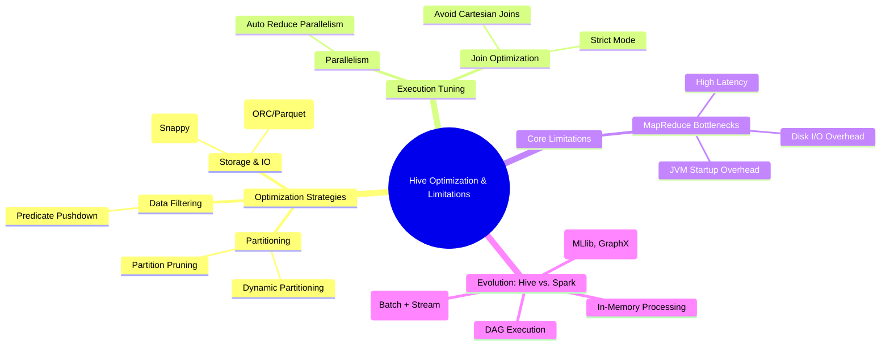

#  Hive Performance & Limitations Mind Map



---

#  Part 1: Optimization Strategies (Overcoming Limitations)

These techniques address Hive's inherent slowness by reducing data scanned and optimizing resource usage.

### 1. Partition Pruning

* **Definition:** Allows Hive to skip unnecessary subdirectories (partitions) based on the `WHERE` clause.
* **Example Query:**
```sql
-- Without Pruning: Scans all regions/dates
-- With Pruning: Scans only the 'US' and '2024-01-01' partition
SELECT order_id, amount FROM sales 
WHERE region = 'US' AND order_date = '2024-01-01'; 

```


* **Best Practice:** Always partition by frequently filtered columns like **date** or **region**.

### 2. Predicate Pushdown (PPD)

* **Definition:** Filters data at the **storage layer** (ORC/Parquet) before it’s even read into the query engine.
* **Benefits:** Drastically reduces Disk I/O by only pulling rows that match the filter (e.g., `amount > 1000`).
* **Best Practice:** Use **ORC** or **Parquet** formats to enable this.

### 3. Dynamic Partitioning

* **Definition:** Hive automatically creates partitions based on the data values during an insert.
* **Example Query:**
```sql
SET hive.exec.dynamic.partition = true;
SET hive.exec.dynamic.partition.mode = nonstrict;

INSERT INTO TABLE sales_partitioned PARTITION (region, order_date)
SELECT order_id, amount, region, order_date FROM unpartitioned_sales;

```


### 4. Compression Techniques

* **Goal:** Reduce intermediate (shuffle) and final output size to save storage and speed up network transfer.
* **Top Pick:** **Snappy** is the industry standard for a balance between speed and compression ratio.
* **Key Configs:**
* `SET hive.exec.compress.intermediate=true;`
* `SET mapreduce.map.output.compress.codec=org.apache.hadoop.io.compress.SnappyCodec;`


### 5. Auto Reduce Parallelism

* **Definition:** Dynamically calculates the number of reducers based on input data size to prevent overloading.
* **Key Config:** `SET hive.exec.reducers.bytes.per.reducer = 67108864;` (64MB per reducer).

---

#  Part 2: The Core Limitations (The MapReduce Problem)

Why Hive is being replaced by Spark. The answer lies in the **MapReduce execution engine**.

### 1. Disk I/O Overhead

MapReduce is **disk-based**. It writes intermediate data to HDFS between the Map and Reduce stages, creating a massive bottleneck for complex, multi-stage joins or aggregations.

### 2. High Latency & Startup Overhead

* **JVM Startup:** Every MapReduce job requires launching a new **JVM (Java Virtual Machine)**. For a query with 5 stages, that’s 5 slow startups.
* **Unsuitable for Real-Time:** Because of this "startup tax" and disk-heavy nature, Hive is strictly for **batch processing**, not interactive or real-time queries.

### 3. Cartesian Join "Explosions"

If a join condition is missing, Hive performs a cross-join (every row in Table A x every row in Table B), which can crash a cluster.

* **Fix:** `SET hive.mapred.mode=strict;` prevents queries without join conditions.

---

#  Part 3: Why Spark is the Industry Winner

| Feature | Apache Hive (MapReduce) | Apache Spark |
| --- | --- | --- |
| **Data Processing** | Disk-based (Intermediate data to disk) | **In-Memory** (Intermediate data in RAM) |
| **Execution Model** | Linear Map -> Reduce stages | **DAG (Directed Acyclic Graph)** for optimized parallel steps |
| **Performance** | Slower (Batch only) | **10x to 100x faster** than Hive/MapReduce |
| **Functionality** | SQL only (HiveQL) | Unified: SQL, Streaming, MLlib (ML), GraphX |

---

#  External Expert Additions 

* **Tez Engine:** In interviews, mention that Hive can use **Tez** instead of MapReduce. Tez creates a DAG (like Spark) and keeps data in memory between stages, making Hive significantly faster without moving to Spark.
* **CBO (Cost-Based Optimizer):** Hive uses **Apache Calcite** to look at table statistics and decide the best way to run a query (e.g., joining smaller tables first).
* **LLAP (Live Long and Process):** A Hadoop 3.x feature that uses "persistent daemons" to cache data in memory, allowing for sub-second query response times in Hive.
* **Vectorization:** Instead of processing 1 row at a time, Hive can process a batch of **1024 rows** at once, which is much easier on the CPU.

---

