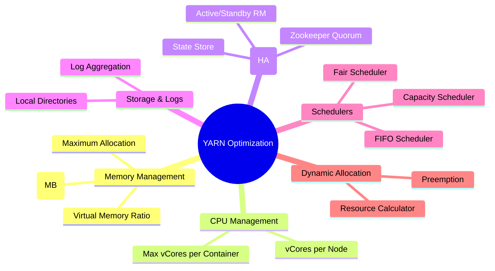

# YARN Resource Allocation & Optimization: 

##  YARN Optimization Mind Map



---

##  1. Core Resource Management

In YARN, resource allocation is primarily defined in the `yarn-site.xml` file.

### A. Memory Management

Memory is often the most constrained resource in a cluster.

* **`yarn.nodemanager.resource.memory-mb`**: The total physical memory YARN can use on a single node.
* *Rule of Thumb:* Leave **15-20%** of RAM for the OS and other services (like DataNode or HBase).


* **`yarn.scheduler.maximum-allocation-mb`**: The limit for a single container. If a Spark executor or Hive task asks for more than this, the request will be rejected.
* **`yarn.nodemanager.vmem-pmem-ratio`**: The ratio of virtual memory to physical memory (default is **2.1**). If a job uses too much virtual memory, YARN will kill the container.

**Configuration Example:**

```xml
<property>
  <name>yarn.nodemanager.resource.memory-mb</name>
  <value>61440</value> </property>

```

### B. CPU Management

YARN uses **vCores** (virtual cores) to manage CPU resources.

* **`yarn.nodemanager.resource.cpu-vcores`**: Total vCores available for containers on the node. Typically set to the number of physical cores or a multiple (if hyper-threading is active).
* **`yarn.scheduler.maximum-allocation-vcores`**: The maximum number of vCores a single container can request.

---

## 2. YARN Schedulers

Understanding how YARN decides which job gets resources.

| Scheduler | Best For | Logic |
| --- | --- | --- |
| **FIFO** | Small, private clusters | First-come, first-served. Simple but leads to "head-of-line blocking." |
| **Capacity** | Large, multi-tenant clusters | Guaranteed "minimum" capacity for departments/queues. Supports **Elasticity** (borrowing idle resources). |
| **Fair** | Ad-hoc, shared clusters | Dynamically balances resources so all jobs get an equal share over time. |

---

## 🛡️ 3. High Availability (HA)

To prevent the Resource Manager (RM) from being a **Single Point of Failure (SPOF)**, YARN supports an Active/Standby configuration.

* **Components:** Two RMs (Active and Standby) and a **Zookeeper Quorum**.
* **Failover Controller:** Automatically promotes the Standby RM if the Active one fails.
* **State Store:** Usually stored in Zookeeper or HDFS to keep track of running applications during a failover.

**Configuring HA:**

```xml
<property>
  <name>yarn.resourcemanager.ha.enabled</name>
  <value>true</value>
</property>
<property>
  <name>yarn.resourcemanager.zk-address</name>
  <value>zk1:2181,zk2:2181,zk3:2181</value>
</property>

```

---

## 4. Disk & Log Management

### A. Local Directories

YARN needs local disk space to store intermediate shuffle data (for MapReduce/Spark) and localized resources.

* **`yarn.nodemanager.local-dirs`**: Spread this across multiple physical disks to increase I/O throughput.

### B. Log Aggregation

By default, logs stay on the local node. If a node fails, logs are lost.

* **Optimization:** Enable **Log Aggregation** to move logs to HDFS once the application finishes.
* **Property:** `yarn.log-aggregation-enable = true`.

---

## 5. Expert Additions

### Resource Preemption

In a Capacity Scheduler, if a high-priority queue needs resources currently "borrowed" by a low-priority queue, YARN can **preempt** (kill) the low-priority containers to reclaim resources.

* *Key Setting:* `yarn.resourcemanager.scheduler.monitor.enable = true`.

### Dominant Resource Fairness (DRF)

By default, YARN only considers **Memory** when scheduling. If your jobs are CPU-heavy, you should enable **DRF**, which considers both Memory and CPU during allocation.

* *Key Setting:* Change `ResourceCalculator` to `DominantResourceCalculator`.

### Speculative Execution

If a task is running significantly slower than its peers (due to faulty hardware or data skew), YARN can launch a **speculative copy** of that task on another node. Whichever finishes first is kept.

---

###  YARN Checklist:

#### 1. Difference between Physical Memory and Virtual Memory in YARN

* **Physical Memory (`pmem`)**: This is the actual **RAM** available on a cluster node. In YARN, it is managed by the parameter `yarn.nodemanager.resource.memory-mb`. It prevents the node from being overwhelmed by containers that consume too much physical RAM.


* **Virtual Memory (`vmem`)**: This refers to the total address space a process can use, including physical RAM and **swap space** on the disk. YARN monitors this using a ratio (default 2.1) defined by `yarn.nodemanager.vmem-pmem-ratio`.
* **Key Point**: If a container’s process exceeds its virtual memory limit, YARN will kill the container immediately, even if physical RAM is still available.

#### 2. How Capacity Scheduler handles Multi-Tenancy

* 
**Hierarchical Queues**: The Capacity Scheduler allows multiple organizations or "tenants" to share a cluster by dividing resources into **Queues** (e.g., 60% for Analytics, 40% for ETL).


* **Guaranteed Capacity**: Each queue is guaranteed a minimum percentage of the cluster's resources, ensuring that a large job in one department doesn't starve the jobs of another.
* **Elasticity**: If a queue is idle, other queues can "borrow" its capacity to run their jobs. However, if the original owner needs those resources back, YARN can **preempt** (kill) the borrowing containers to reclaim the space.

#### 3. How the Application Master (AM) negotiates resources with the Resource Manager (RM)

* 
**Step 1: Submission**: When you submit a job, the RM's **Scheduler** selects a NodeManager to launch the **Application Master** (AM).


* **Step 2: Negotiation**: The AM acts as a "negotiator" for that specific job. It sends resource requests (number of containers, CPU, and Memory) to the **Resource Manager**.


* 
**Step 3: Allocation**: The RM's Scheduler grants these containers based on available cluster capacity and queue rules.


* 
**Step 4: Execution**: The AM then coordinates with individual **NodeManagers** to launch the actual tasks within those allocated containers.


#### 4. What happens to a running job if the Active Resource Manager fails?

* 
**Failover Mechanism**: In a **High Availability (HA)** setup, YARN runs a pair of Resource Managers in an **Active/Standby** configuration.


* **Zookeeper Coordination**: A tool like **Zookeeper** monitors the health of the Active RM. If it detects a failure, it triggers an election to promote the **Standby RM** to Active status.


* **Job Continuity**: Because the state of all running applications is preserved in a "State Store" (like Zookeeper or HDFS), the new Active RM can recover the job's progress. The cluster continues to function without the user having to restart their jobs.


