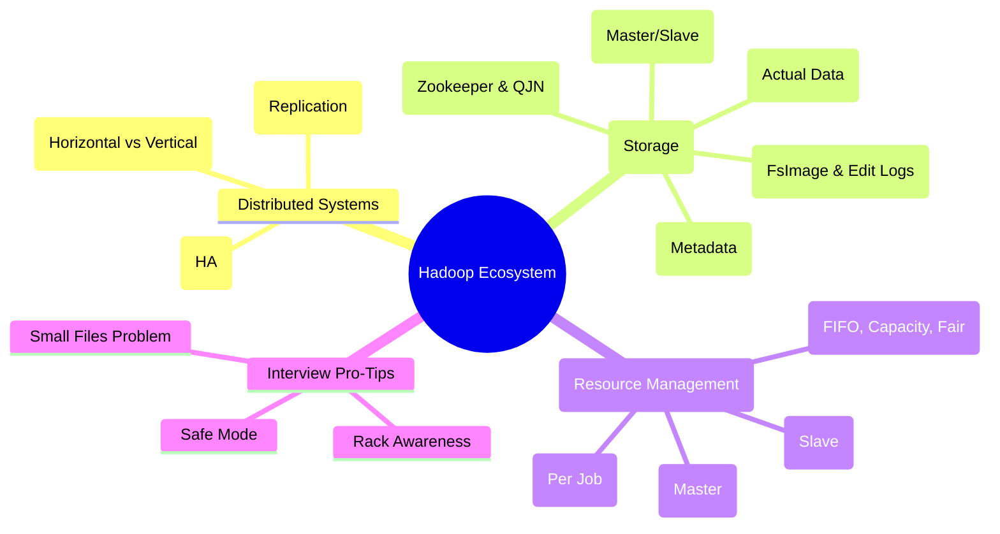
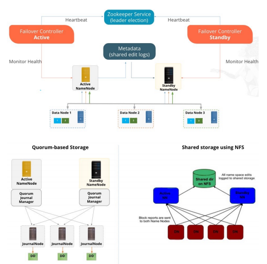
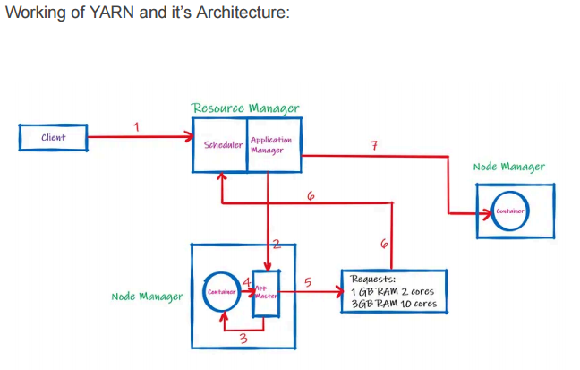

# Apache Hadoop & YARN Deep Dive

##  Hadoop Mind Map

---

##  1. HDFS: The Storage Layer

HDFS is a distributed file system designed to run on **commodity hardware**. It provides high aggregate bandwidth across the cluster and is optimized for large files.

### Master-Slave Architecture

* **NameNode (Master):** The centerpiece of the HDFS architecture. It maintains the **metadata**—the "map" of where every file's blocks are stored across the cluster. It keeps the entire namespace in RAM for fast access.
* **DataNode (Slave):** These nodes do the heavy lifting. They store the actual **data blocks** (default 128MB) and perform read/write operations as directed by the NameNode.

### Metadata & Persistence

* **FsImage:** A persistent "snapshot" of the file system's state on disk.
* **Edit Logs:** A log of recent changes (like file creation or deletion). On startup, the NameNode merges the FsImage and Edit Logs to reconstruct the latest state of the file system.

---

## 2. YARN: The Resource Manager

YARN (Yet Another Resource Negotiator) acts as the **operating system** for Hadoop. It separates the resource management functions from the data processing functions.

### Key Components

* **Resource Manager (RM):** The "Boss" of the cluster. It decides who gets what resources (RAM/CPU) across the entire system.
* **Node Manager (NM):** The "Manager" on each specific machine. It monitors the health of that machine and reports back to the Resource Manager.
* **Application Master (AM):** A dedicated "Lead" for a specific job (e.g., a Spark job or Hive query). It negotiates resources with the RM and works with NMs to execute tasks.
* **Container:** A package of resources (e.g., 2GB RAM, 1 CPU Core) where the actual task runs. AM share CLC (Container Launch Certificate) with container to start task.

---

##  3. Fault Tolerance & Rack Awareness

Hadoop is built on the assumption that **hardware will fail**. It handles this through clever placement and replication.

### Replication Strategy

By default, Hadoop creates **3 copies** of every block. It uses a "Rack Awareness" algorithm to ensure data safety:

1. **Copy 1:** Stored on the local node (or a node in the same rack).
2. **Copy 2:** Stored on a **different rack**.
3. **Copy 3:** Stored on that **same different rack** but on a different node.

This ensures that if an entire rack's power supply or switch fails, your data is still available elsewhere in the cluster.

---

## 4. Essential HDFS Commands

Basic CLI commands to test practical knowledge:

* **Upload File:** `hdfs dfs -put /local/file.txt /hdfs/path/`
* **Download File:** `hdfs dfs -get /hdfs/path/file.txt /local/`
* **List Directory:** `hdfs dfs -ls /`
* **Check File Status:** `hdfs dfs -stat /path/to/file` (Shows size, replication, and modification time).
* **Monitor Logs:** `hdfs dfs -tail /path/to/log` (Shows the last few lines of a file).

---

##  5. Pro-Tips (Expert Insights)

* **The "Small Files" Problem:** Having millions of files smaller than the 128MB block size is bad. Each file's metadata takes up about **150 bytes in the NameNode's RAM**. Too many small files can crash the NameNode.
* **Safe Mode:** This is a "Read-Only" state HDFS enters during startup. It waits for DataNodes to report their blocks. If the NameNode doesn't receive reports for at least **99.9% of blocks**, it won't leave Safe Mode.
* **High Availability (HA):** In modern Hadoop (2.x+), we use a **Standby NameNode**. A "Zookeeper" service monitors the Active NameNode; if it fails, Zookeeper automatically promotes the Standby to Active in seconds.

