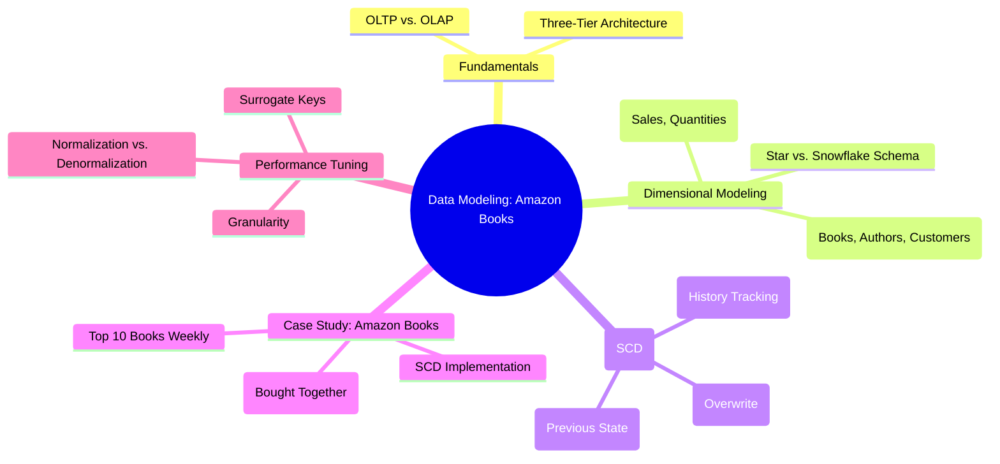
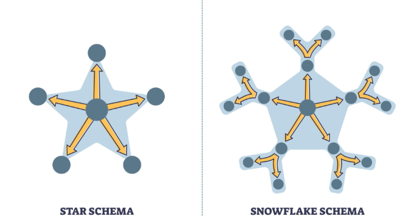

# Data Modeling Mind Map



---

# Core Concepts: OLTP vs. OLAP

In a Data Engineering, you must distinguish between the system that **records** data and the system that **analyzes** it.

* **OLTP (Online Transaction Processing):**
* **Purpose:** Supports real-time business transactions (e.g., buying a book).
* **Database:** Amazon uses **DynamoDB**.
* **Operations:** High volume of inserts, updates, and deletes.
* **Focus:** Response time and data integrity.


* **OLAP (Online Analytical Processing):**
* **Purpose:** Supports complex queries, trend analysis, and decision-making.
* **Database:** Data Warehouses (e.g., Redshift, BigQuery).
* **Focus:** Query performance and scanning billions of rows.


---

#  Dimensional Modeling Elements

### 1. Fact Tables

These store the **quantitative** data (metrics) of a business process.

* **Example:** `Fact_Sales` contains `quantity_sold`, `total_price`, and `tax_amount`.
* **Key Insight:** Fact tables are usually very large and contain foreign keys to dimension tables.

### 2. Dimension Tables

These store the **descriptive** attributes (context).

* **Example:** `Dim_Book` (Title, ISBN, Category), `Dim_Author` (Name, Nationality), `Dim_Time` (Year, Month, Week).

### 3. Star vs. Snowflake Schema

* **Star Schema:** The simplest form. Dimensions are directly connected to the fact table. It is **denormalized**, which makes it much faster for reading data.
* **Snowflake Schema:** Dimensions are **normalized** (split into multiple tables). This saves storage space but makes queries slower because of more "JOINs".


---

#  Handling History: Slowly Changing Dimensions (SCD)

It defines how we handle data that changes over time (e.g., a customer moves to a new city).

| SCD Type | Action | History Preserved? |
| --- | --- | --- |
| **Type 1** | Overwrites old data with new data. | **No.** |
| **Type 2** | Creates a new row with a new version/date. | **Yes (Full History).** |
| **Type 3** | Adds a new column for the "previous" value. | **Partial (Current vs. Previous).** |

---

#  Case Study: Amazon Books Design

### The Problem

Amazon needs to track weekly top books, frequently bought items, and author performance across print and e-books.

### Proposed Schema Structure

* **Fact Table:** `Fact_Orders`
* `order_key` (Surrogate Key)
* `book_key`, `customer_key`, `date_key`, `author_key` (Foreign Keys)
* `sales_amount`, `discount`, `format` (Print/E-book)


* **Dimensions:** `Dim_Customer`, `Dim_Book`, `Dim_Author`, `Dim_Date`.

### Query Example: Top 10 Books Sold Weekly

```sql
SELECT 
    b.book_title, 
    SUM(f.sales_amount) as total_sales
FROM Fact_Orders f
JOIN Dim_Book b ON f.book_key = b.book_key
JOIN Dim_Date d ON f.date_key = d.date_key
WHERE d.week_number = 3 -- Current Week
GROUP BY b.book_title
ORDER BY total_sales DESC
LIMIT 10;

```

---

#  Expert Additions 

### 1. The Concept of "Grain"

Before designing, you must define the **Granularity**. For Amazon, is the grain "one row per order" or "one row per item in the basket"?

* **Tip:** Always recommend the **lowest grain** (most detailed) possible to allow for maximum flexibility in future analysis.

### 2. Surrogate Keys vs. Natural Keys

* **Natural Key:** A real-world ID like an ISBN or Social Security Number.
* **Surrogate Key:** A system-generated integer (e.g., 1, 2, 3).
* **Why use Surrogate Keys?** They protect the Data Warehouse from changes in the source system (e.g., if a book's ISBN changes) and improve Join performance.

### 3. Factless Fact Tables

Sometimes you need to track events that don't have a "price" or "quantity."

* **Example:** Tracking which books customers *clicked on* but didn't buy. This is called a **Factless Fact Table**.

---

### 💡 Final Interview Advice:

Question?, **"Should we normalize our Data Warehouse?"**, your answer should be: **"No, we typically denormalize into a Star Schema to reduce JOINs and maximize read performance, as storage is cheap but compute/time is expensive."**

