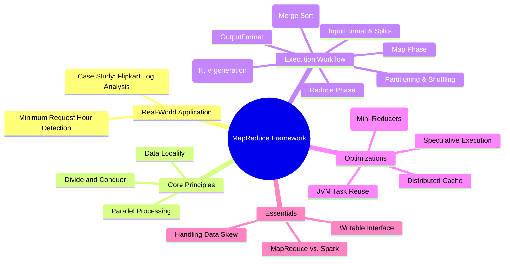
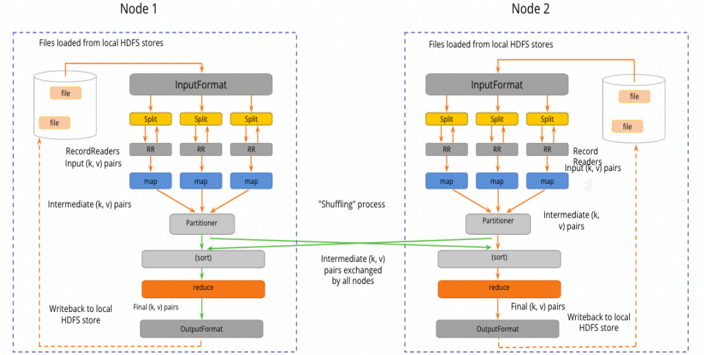
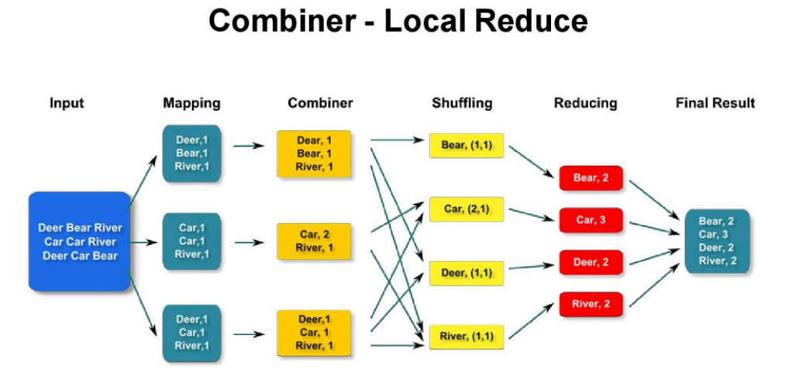

# MapReduce Framework: 

##  MapReduce Mind Map



---

##  1. Real-World Case Study: Flipkart & "Wanna Cry"

In 2017, the "Wanna Cry" ransomware hit globally. Flipkart had to patch 4000 Windows servers, requiring a full system restart.

* **The Problem:** Finding the "Golden Hour"—the specific hour with the lowest traffic—to minimize business impact.
* **Data Volume:** 200–300 GB of unstructured log files.
* **Why MapReduce?** * Standard scripts (Python/Java) are too slow for hundreds of GBs.
* RDBMS cannot handle unstructured logs easily.
* MapReduce provides a reliable, distributed way to process logs in parallel across a cluster.


---

##  2. Core Components & Architecture

### Data Input Logic

* **InputFormat:** Defines how to read data from HDFS (e.g., `TextInputFormat`).
* **InputSplit:** A logical representation of data. Usually matches the HDFS block size (**128MB**). It provides the boundaries for each Mapper task.
* **RecordReader:** Converts the raw data in a split into **Key-Value (K, V) pairs** that the Mapper can understand.

### The Transformation Process

1. **Map Phase:** Processes each record from the RecordReader. It filters and sorts data to emit intermediate key-value pairs.
2. **Partitioner:** Decides which Reducer will process a specific key. The default is `HashPartitioner` (`key.hashCode() % numReducers`).
* *Tip:* All identical keys **must** go to the same reducer to ensure correct aggregation.


3. **Shuffle & Sort:** The "Heart" of MapReduce.
* **Shuffle:** The process of moving map outputs to reducers via the network.
* **Sort:** MapReduce merge-sorts the data by key so the reducer receives a sorted stream.


4. **Reduce Phase:** Aggregates the values associated with a single key.
5. **OutputFormat:** Defines how the final results are written back to HDFS (e.g., `TextOutputFormat`).



---

##  3. Query Example: Log Analysis

To solve the Flipkart case study, the Mapper extracts the "hour" from a log timestamp and emits it with a count of 1.

**Mapper Logic (Conceptual):**

```python
# Mapper Input: (offset, "2017-05-12 14:22:01 INFO ...")
# Mapper Output: ("14", 1)

import re

def map(key, value):
    log_line = value.toString()
    # Regex to find timestamp pattern [DD/MM/YYYY:HH:MM:SS]
    match = re.search(r'(\d{2}/\d{2}/\d{4}:(\d{2}):\d{2}:\d{2})', log_line)
    if match:
        hour = match.group(2)
        emit(hour, 1)

```

**Reducer Logic (Conceptual):**

```python
# Reducer Input: ("14", [1, 1, 1, ...])
# Reducer Output: ("14", 5000)

def reduce(key, values):
    total_requests = sum(values)
    emit(key, total_requests)

```

---

##  4. Advanced Performance Optimizations

### Combiners (The "Mini-Reducer")

A Combiner is an optional class that runs on the **Mapper node** to perform local aggregation.

* **Benefit:** Reduces the amount of data sent over the network during the Shuffle phase.
* **Rule:** The Combiner's output must match the Reducer's input.
* *Code snippet:* `job.setCombinerClass(MyReducer.class);`



### Distributed Cache

Used to share small, read-only files (like lookup tables, zip files, or jars) across all nodes in the cluster. Each node gets a **local copy**, preventing repeated HDFS reads.

### JVM Task Reuse

Initializing a JVM for a task takes time. If you have many small tasks running for less than a minute, set `mapreduce.job.jvm.numtasks` to `-1` or a specific number to reuse the JVM for multiple tasks, reducing startup overhead.

### Memory Tuning

The parameter `mapred.child.java.opts` controls the heap size for the Mapper/Reducer tasks. A common rule is to use as much memory as possible without triggering disk swapping.

---

##  5. Expert Tips

* **Writable Interface:** Unlike standard Java Serialization, Hadoop uses the `Writable` interface. It is **compact, fast, and extensible**, which is critical for efficient network transfer.
* **Speculative Execution:** If one node is performing poorly (a "straggler"), Hadoop launches an identical task on another node. Whichever finishes first is kept, and the other is killed.
* **Data Skew:** This happens when one Reducer receives significantly more data than others (e.g., one "hour" having 90% of traffic).
* *Solution:* Use a **Custom Partitioner** or add a "salt" (random prefix) to the keys to distribute them more evenly.


* **MapReduce vs. Spark:** * MapReduce is **disk-based** (writes to disk after every stage).
* Spark is **memory-based** (keeps data in RAM).
* Use MapReduce for massive batch jobs where memory is a bottleneck; use Spark for iterative algorithms and low-latency processing.

