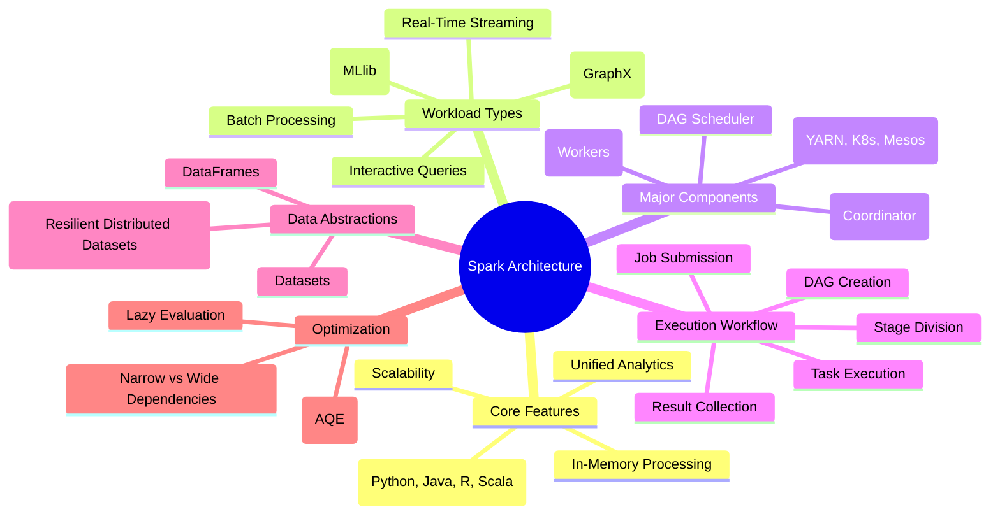
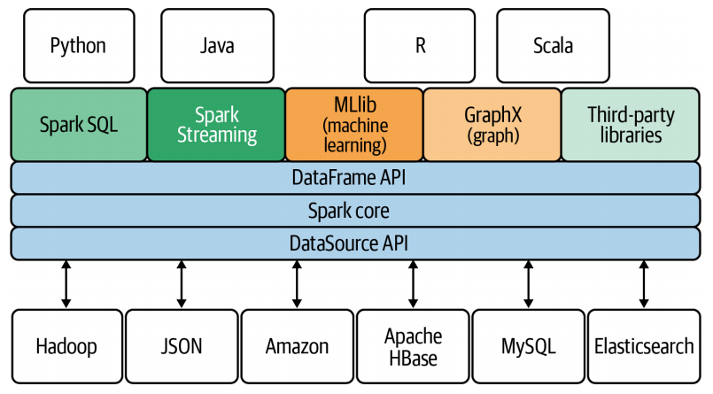
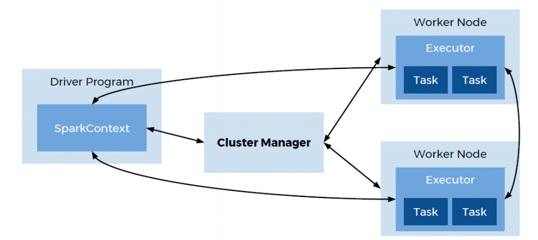

# Spark Architecture: 
Apache Spark is a high-speed, unified analytics engine designed for large-scale data processing. Unlike older systems like Hive (which rely on disk-based MapReduce), Spark performs **in-memory computation**, making it significantly faster for most data tasks.

---

## 🧠 Spark Architecture Mind Map

---

##  1. Core Features and Capabilities

* **In-Memory Processing:** Spark performs most operations in RAM. This reduces the time spent reading from and writing to disks, which is the main reason it outperforms MapReduce.
* **Unified Analytics:** You can handle batch processing, real-time streaming, machine learning, and graph data all within the same engine.
* **Scalability:** Spark is flexible. It can run on a single laptop or be scaled up to thousands of nodes in a massive cluster.
* **Multi-Language Support:** It provides high-level APIs for **Java, Scala, Python, and R**, making it accessible to different types of developers.

### **The Spark Ecosystem Stack**

Spark is built on a "Core" engine with several specialized libraries:

* **Spark SQL:** For working with structured data and running SQL queries.
* **Spark Streaming:** For processing real-time data feeds.
* **MLlib:** A built-in library for machine learning algorithms.
* **GraphX:** For graph processing and social network analysis.
* **DataSource API:** Connects Spark to various storage systems like **HDFS (Hadoop), JSON, Amazon S3, HBase, MySQL, and Elasticsearch**.

---

##  2. The Four Pillars of Spark Architecture

### **A. Driver Program (The Master)**

The Driver is the "brain" of the application. It runs the `main()` function and is responsible for:

* Converting user code into a logical plan.
* Creating the **DAG (Directed Acyclic Graph)**.
* Scheduling tasks and coordinating with the Cluster Manager.
* Collecting final results from executors.

### **B. Executors (The Workers)**

Executors are processes that run on worker nodes. Their jobs are to:

* Run the tasks assigned by the Driver.
* Store data in memory or on disk (caching).
* Report the status and results of tasks back to the Driver.

### **C. Cluster Manager**

The Cluster Manager allocates resources across the cluster. Spark supports several types:

* **Standalone:** Spark’s built-in simple manager.
* **YARN:** The resource manager for Hadoop environments.
* **Mesos:** A general cluster manager that can also run Hadoop.
* **Kubernetes (K8s):** For containerized Spark deployments.

### **D. DAG Scheduler**

The DAG Scheduler is the optimizer. Instead of running every command one by one, it looks at the whole sequence of operations and organizes them into **Stages** based on data dependencies.

---

##  3. Execution Workflow: From Code to Results

1. **Job Submission:** The user submits a Spark application to the cluster.
2. **DAG Creation:** The Driver builds a graph of all the transformations needed to reach the final result.
3. **Stage Division:** The DAG is broken into stages. A new stage is created whenever data needs to be "shuffled" across nodes.
4. **Task Scheduling:** Stages are broken into smaller **Tasks**, which are sent to the executors.
5. **Task Execution:** Executors process the data in parallel across the cluster.
6. **Result Collection:** Once tasks are done, the Driver pulls the results together.
7. **Data Persistence:** If requested, the results are saved back to HDFS, S3, or a database.

---

##  4. Data Abstractions (The Containers)

* **RDD (Resilient Distributed Dataset):** The basic building block. It is a fault-tolerant collection of elements that can be operated on in parallel.
* **DataFrame:** Like a table in a relational database. It has named columns and is more optimized than a raw RDD.
* **Dataset:** Available in Scala/Java, it provides the benefits of DataFrames but with "type-safety" (prevents errors during coding).

---

##  5. Advanced Topics

To truly impress , you should understand these "under-the-hood" concepts:

### **Lazy Evaluation**

Spark does not execute transformations (like `filter` or `map`) immediately. It just records them in the DAG. It only starts the heavy lifting when an **Action** (like `count`, `collect`, or `save`) is called. This allows Spark to optimize the execution plan.

### **Narrow vs. Wide Dependencies**

* **Narrow Dependency:** Each partition of the parent RDD is used by at most one partition of the child RDD (e.g., `map`, `filter`). No data movement across the network is needed.
* **Wide Dependency (Shuffle):** Multiple child partitions depend on a single parent partition (e.g., `groupByKey`, `join`). This requires a **Shuffle**, which is slow and expensive.

### **Adaptive Query Execution (AQE)**

Modern Spark (3.0+) uses AQE to re-optimize the query plan *while the job is running* based on the actual size of the data it discovers. It can merge small shuffle partitions or turn a slow Sort-Merge join into a fast Broadcast join on the fly.

### **Memory Management**

Spark memory is divided into two main parts:

1. **Execution Memory:** Used for shuffles, joins, and aggregations.
2. **Storage Memory:** Used for caching and propagating internal data.
*They can borrow space from each other if one is idle.*

---

### * Expert Tip**

If asked about **Spark vs. Hadoop**, emphasize that Spark is **not** a replacement for HDFS. Spark is a processing engine, while Hadoop is a framework that includes both storage (HDFS) and resource management (YARN). Spark usually runs *on top* of Hadoop to get the best of both worlds.

